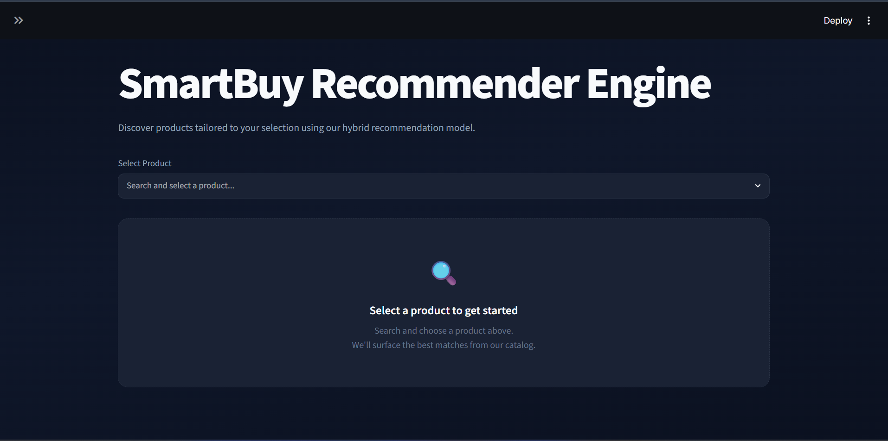
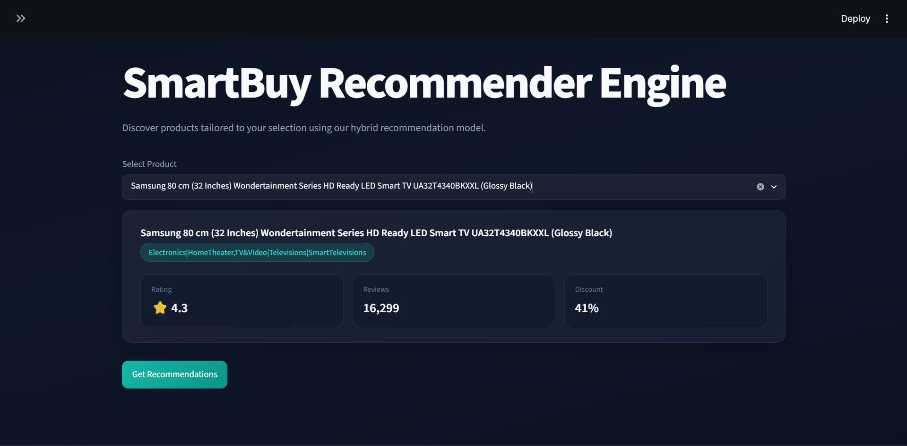
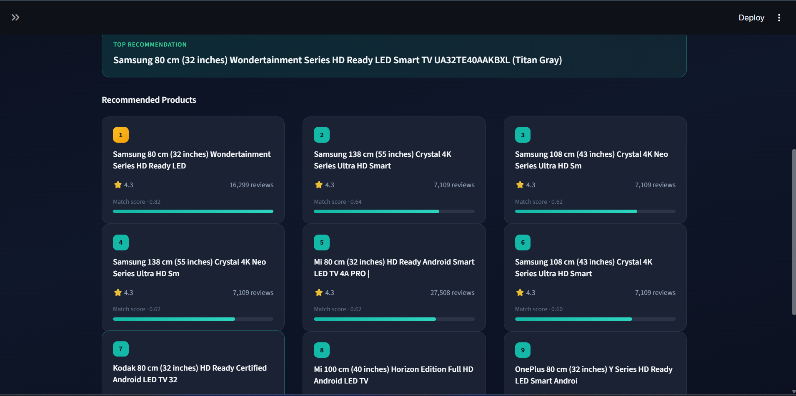

# 🛒 SmartBuy Recommender Engine
## 🌐 Live Demo

[Launch SmartBuy Recommender](https://smartbuy-recommender-engine.streamlit.app/)

A Hybrid Product Recommendation System built using **TF-IDF**, **Cosine Similarity**, **Popularity-Based Ranking**, and **Streamlit**.

The system recommends products similar to a selected item by combining content similarity with product popularity to generate more relevant and practical recommendations.

---

## 📌 Project Overview

SmartBuy Recommender Engine is a machine learning-powered recommendation system designed to help users discover relevant products from an Amazon product dataset.

The project combines:

* Content-Based Filtering
* Popularity-Based Ranking
* Hybrid Recommendation Strategy

to improve recommendation quality and user experience.

---

## 🚀 Features

* Content-Based Product Recommendations
* TF-IDF Text Vectorization
* Cosine Similarity Search
* Popularity-Based Ranking
* Hybrid Recommendation System
* Interactive Streamlit Dashboard
* Product Metrics Display
* Modern Recommendation Cards UI
* Serialized Models using Pickle

---

## 📊 Dataset

Amazon Product Dataset

Features used:

* Product Name
* Category
* Product Description
* Rating
* Rating Count
* Discount Percentage

---

## ⚙️ Project Workflow

1. Data Cleaning
2. Feature Engineering
3. TF-IDF Vectorization
4. Cosine Similarity Calculation
5. Content-Based Recommendation
6. Popularity Score Calculation
7. Hybrid Recommendation Generation
8. Model Serialization
9. Streamlit Application Development

---

## 🛠️ Tech Stack

### Programming Language

* Python

### Libraries

* Pandas
* NumPy
* Scikit-Learn
* Streamlit
* Matplotlib
* Seaborn

### Model Persistence

* Pickle

### Version Control

* Git
* GitHub

---

## 📁 Project Structure

```text
SmartBuy Recommender Engine/
│
├── assets/
├── data/
├── models/
├── notebooks/
├── reports/
├── utils/
│   └── recommender.py
│
├── app.py
├── requirements.txt
├── README.md
└── .gitignore
```

---

## 📸 Application Screenshots


### Home Page



### Product Details



### Recommendations



---

## 💻 Installation

Clone the repository:

```bash
git clone <your-repository-url>
```

Navigate to the project folder:

```bash
cd smartbuy-recommender-engine
```

Install dependencies:

```bash
pip install -r requirements.txt
```

Run the application:

```bash
streamlit run app.py
```

---

## 🔮 Future Improvements

* Sentence Transformer Embeddings
* FAISS Similarity Search
* Collaborative Filtering
* Recommendation Explainability
* Cloud Deployment

---

## 👩‍💻 Author

Anwesa Sahu
